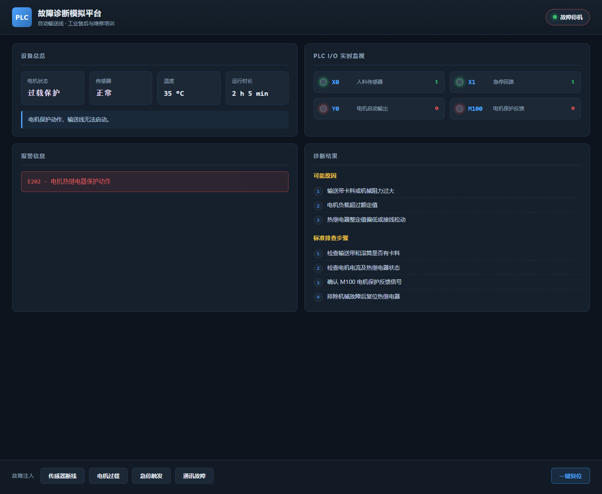

# PLC Fault Diagnosis Simulator

一个用于工业自动化售后与维修培训的网页版 PLC 故障诊断模拟平台。项目以“自动输送线”为对象，通过模拟 PLC I/O 信号变化，演示从报警到故障定位的现场排查流程。

  

## 界面预览



> 上图为注入「电机过载」故障后的界面：Y0 电机启动输出与 M100 电机保护反馈同时熄灭，右侧同步给出可能原因与标准排查步骤。

## 功能

- 实时展示输送线、电机、传感器、温度和运行时长状态
- 模拟传感器断线、电机过载、急停触发、PLC 与变频器通讯故障
- 根据故障自动更新 PLC 输入/输出状态（X0、X1、Y0、M100）
- 输出对应的报警、可能原因和标准排查步骤
- 一键恢复设备正常状态

## 项目结构

```text
PLC-Fault-Diagnosis-Simulator/
├── app.py                  # Flask 应用：配置化故障字典 + REST 接口
├── requirements.txt        # 运行依赖
├── requirements-dev.txt    # 开发依赖（pytest）
├── conftest.py             # pytest 路径配置
├── static/
│   ├── style.css           # 工业监控风格样式
│   └── script.js           # 状态轮询与面板渲染
├── templates/
│   └── index.html          # 页面模板
├── tests/
│   └── test_app.py         # 接口与模板回归测试
├── screenshots/
│   └── ui-overview.png     # 界面预览
├── LICENSE
└── README.md
```

## 快速开始

```bash
git clone https://github.com/ayybyw/PLC-Fault-Diagnosis-Simulator.git
cd PLC-Fault-Diagnosis-Simulator
python -m venv .venv
```

Windows：

```bash
.venv\Scripts\activate
pip install -r requirements.txt
python app.py
```

浏览器打开 `http://127.0.0.1:5000`。

## 测试

```bash
pip install -r requirements-dev.txt
pytest tests/ -v
```

覆盖首页模板渲染、静态资源可访问、四类故障的关键信号位与报警码、未知故障返回 404、一键复位恢复基线，以及故障切换不残留旧状态，共 11 项用例。

## 接口

| 方法 | 路径 | 说明 |
| --- | --- | --- |
| GET | `/api/status` | 查询设备当前状态与 I/O 点位 |
| POST | `/api/fault/<fault_key>` | 注入故障，`fault_key` 取 `sensor` / `overload` / `emergency` / `communication` |
| POST | `/api/reset` | 一键复位到正常状态 |

## 诊断逻辑

四类故障各自对应的关键 PLC 信号与典型排查方向：

- 传感器断线 —— 关键信号：X0 = OFF。排查方向：传感器供电、接线、输入模块
- 电机过载 —— 关键信号：M100 = OFF，Y0 = OFF。排查方向：卡料、电机电流、热继电器
- 急停触发 —— 关键信号：X1 = OFF，Y0 = OFF。排查方向：急停按钮、安全继电器、安全回路
- 通讯故障—— 关键信号：Y0 = OFF。排查方向：通讯线缆、站号、波特率、变频器状态

## 已知限制与后续计划

### 已知限制

- 未接入真实 PLC：所有 I/O 状态均为内存模拟，尚未对接 Modbus TCP、S7 等协议，因此无法体现真实扫描周期下的信号抖动与时序
- 点位覆盖有限：只抽象了 X0、X1、Y0、M100 四个关键点，真实产线的 I/O 数量通常在几十到上百
- 单故障假设：一次只能注入一个故障，没有考虑多故障并发与连锁停机等现场常见情况
- 无状态持久化：设备状态存放在进程内存中，重启即复位，也没有训练过程记录

### 后续计划

- 用 Modbus TCP 对接真实 PLC 或仿真器，把模拟点位换成实采数据
- 引入故障演化模型（间歇性故障、由轻到重），替代当前的瞬时切换
- 记录学员的排查路径与耗时，生成训练评分报告
- 支持多人同时训练时，把设备状态改为按 session 隔离

## License

MIT
